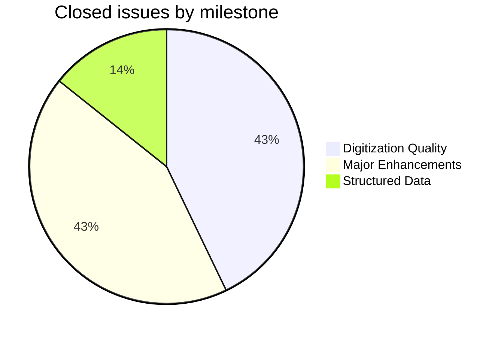
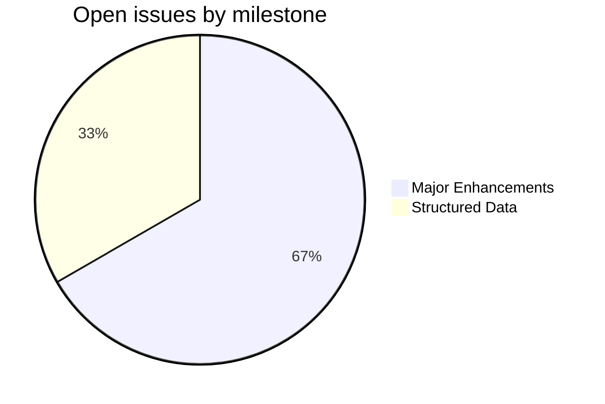

FRI
===

Frish, Oldřich (1903–1955). *Sanskrtská čítanka* (Sanskrit Reader). Moscow: ABV, 2015. Vol. 2.

This repository holds corrections and tooling for the [Cologne digitization](http://www.sanskrit-lexicon.uni-koeln.de/) of the FRI Sanskrit reader. The canonical source data (`fri.txt`) lives in [csl-orig](https://github.com/sanskrit-lexicon/csl-orig); the build system is in [csl-pywork](https://github.com/sanskrit-lexicon/csl-pywork). Issues and corrections are tracked at the [FRI GitHub issue tracker](https://github.com/sanskrit-lexicon/FRI/issues).

## Contents

| Directory | Description |
|-----------|-------------|
| `fri_01/` | Display and correction work for the first processed version |
| `issues/` | Per-issue correction workflows |
| `fri_00.txt` | Initial SLP1 source text |

## Timeline

| Period | Milestone |
|--------|-----------|
| Jan 2024 | Repository initialized; initial `fri_00.txt` version (#1) |
| Jan–Feb 2025 | `fri_01` display work and image index corrections (#3, #4) |
| Mar 2026 | Latin to Cyrillic string corrections (#8) |

## Projects & Milestones

Work is organised into four GitHub Projects (org-level kanban boards), each mirroring a milestone:

| Project | Milestone | Open | Closed | Scope |
|---|---|---|---|---|
| [**Dictionary to Book**](https://github.com/orgs/sanskrit-lexicon/projects/1) | [milestone](https://github.com/sanskrit-lexicon/FRI/milestone/1) | 0 | 0 | Link targets |
| [**Digitization Quality**](https://github.com/orgs/sanskrit-lexicon/projects/2) | [milestone](https://github.com/sanskrit-lexicon/FRI/milestone/2) | 0 | 3 | Scan quality, encoding, bug fixes |
| [**Structured Data**](https://github.com/orgs/sanskrit-lexicon/projects/3) | [milestone](https://github.com/sanskrit-lexicon/FRI/milestone/3) | 1 | 1 | Markup, abbreviation tooltips |
| [**Major Enhancements**](https://github.com/orgs/sanskrit-lexicon/projects/4) | [milestone](https://github.com/sanskrit-lexicon/FRI/milestone/4) | 2 | 3 | Display upgrades, new versions |

## Issue Typology

#### Solved (closed issues)

| Type | Count | Description | Examples |
|---|---|---|---|
| **Content enhancement** | 3 | Initial display versions, fri_01 setup | Initial displays [#3](https://github.com/sanskrit-lexicon/FRI/issues/3), fri_01 [#2](https://github.com/sanskrit-lexicon/FRI/issues/2), new version [#7](https://github.com/sanskrit-lexicon/FRI/issues/7) |
| **Scan quality** | 2 | Image index corrections, wrong image | Image corrections [#4](https://github.com/sanskrit-lexicon/FRI/issues/4), wrong image [#5](https://github.com/sanskrit-lexicon/FRI/issues/5) |
| **Encoding** | 1 | Latin to Cyrillic string conversion | Cyrillic strings [#8](https://github.com/sanskrit-lexicon/FRI/issues/8) |
| **Markup** | 1 | Bibliographic entry markup | Worldcat entry [#6](https://github.com/sanskrit-lexicon/FRI/issues/6) |

#### Open (work ahead)

| Type | Count | Description | Examples |
|---|---|---|---|
| **Content enhancement** | 2 | 1956 source edition, homepage placement | Čítanka 1956 [#1](https://github.com/sanskrit-lexicon/FRI/issues/1), homepage [#10](https://github.com/sanskrit-lexicon/FRI/issues/10) |
| **Markup** | 1 | Abbreviation tooltips | Tooltips [#9](https://github.com/sanskrit-lexicon/FRI/issues/9) |

## Labels

Every issue carries one **type** label and one **severity** label.

#### Type

| Label | Meaning |
|---|---|
| `markup` | Normalising XML tag content or abbreviation tooltips |
| `text-correction` | Corrections to dictionary text |
| `content-enhancement` | New material, display upgrades, or new versions |
| `encoding` | Character rendering, Latin/Cyrillic conversion |
| `scan-quality` | Replacing wrong or poor-quality scan images |
| `bug` | Broken display or XML structure errors |
| `question` | Scholarly or editorial questions requiring research |

#### Severity

| Label | Meaning |
|---|---|
| `minor` | Targeted, self-contained fix |
| `medium` | Standard unit of work — initial display version, batch corrections |
| `hard` | Large effort spanning many files or sources |

## Contributors

- **Jim Funderburk** ([@funderburkjim](https://github.com/funderburkjim)) — primary repository maintainer
- **Mārcis Gasūns** ([@gasyoun](https://github.com/gasyoun)) — initial commit
